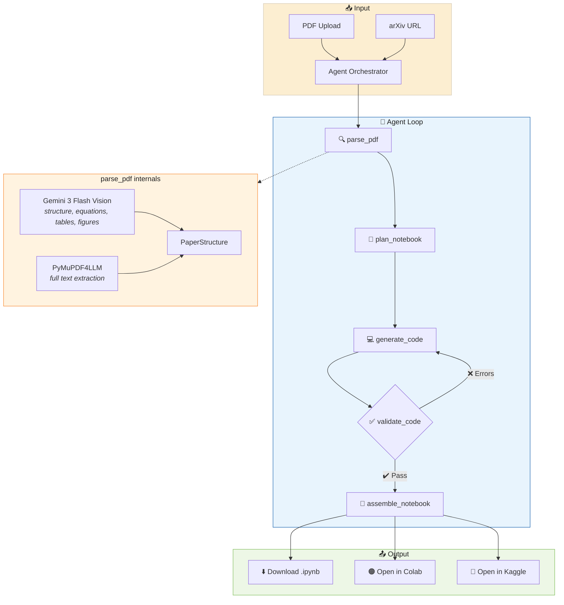

<p align="center">
  <h1 align="center">NoteBrew ☕📓</h1>
  <p align="center">
    <strong>AI agent that brews research papers into executable Jupyter notebooks.</strong>
  </p>
  <p align="center">
    <a href="https://github.com/mysticalseeker24/notebrew/releases"></a>
    <a href="LICENSE"></a>
    <a href="https://www.python.org/"></a>
    <a href="https://nodejs.org/"></a>
    <a href="https://buymeacoffee.com/mysticalseeker02"></a>
  </p>
</p>

<p align="center">
  Drop any research paper PDF or arXiv link → get a runnable Jupyter notebook with real PyTorch code, LaTeX equations, and structured explanations.
</p>

---

## ✨ Features

| Feature | Description |
|---------|-------------|
| 🤖 **Custom AI Agent** | Tool-calling agent that autonomously decides how to parse, plan, code, validate, and assemble |
| 📄 **Hybrid PDF Parser** | Gemini 3 Flash Vision extracts structure; PyMuPDF4LLM extracts full text — best of both worlds |
| 🐍 **PyTorch Code Gen** | Real ML implementations scaled for CPU execution, not pseudocode |
| ✅ **Auto-Validation** | `ast.parse()` syntax checking + import validation with automatic retries |
| 🔗 **arXiv Integration** | Paste an arXiv URL or ID — the agent downloads and parses the paper for you |
| 📐 **LaTeX Equations** | Extracts and renders all mathematical notation in markdown cells |
| ☁️ **Export Anywhere** | Download `.ipynb` · Open in Google Colab · Launch in Kaggle |
| 🔧 **Extensible** | Add new agent tools with a single file — no framework boilerplate |

---

## 🧠 How It Works

NoteBrew uses a **custom AI agent** with a tool-calling loop (no LangChain, no LangGraph) to intelligently process papers end-to-end:



### Agent Tools

| Tool | What It Does | Engine |
|------|-------------|--------|
| `parse_pdf` | Extracts text, sections, equations, tables, figures, references | Gemini Vision + PyMuPDF4LLM |
| `parse_arxiv` | Downloads paper from arXiv, then delegates to `parse_pdf` | `arxiv` library |
| `plan_notebook` | Plans notebook structure — cells, sections, framework, dependencies | Gemini 3 Flash |
| `generate_code` | Generates PyTorch code for each planned cell with full paper context | Gemini 3 Flash |
| `validate_code` | Syntax check via `ast.parse()` + import validation | Local (no LLM) |
| `assemble_notebook` | Builds final `.ipynb` with markdown + code cells | `nbformat` |

---

## 🛠️ Tech Stack

<table>
<tr><td><b>Layer</b></td><td><b>Technology</b></td></tr>
<tr><td>Backend</td><td>Python 3.11+ · FastAPI · Uvicorn · Pydantic v2</td></tr>
<tr><td>Frontend</td><td>Next.js 14 · TypeScript · shadcn/ui · Framer Motion · Tailwind CSS</td></tr>
<tr><td>Design</td><td>Cream Codex palette · Inter + JetBrains Mono + Space Grotesk</td></tr>
<tr><td>PDF Parsing</td><td>Gemini 3 Flash Vision (primary) · PyMuPDF4LLM (fallback)</td></tr>
<tr><td>LLM</td><td>Gemini 3 Flash Preview (primary) · MiniMax M2.5 (fallback)</td></tr>
<tr><td>LLM API</td><td>OpenRouter via OpenAI SDK v2</td></tr>
<tr><td>Notebooks</td><td>nbformat · nbconvert</td></tr>
</table>

---

## � Quick Start

### Prerequisites

- Python 3.11+
- Node.js 18+
- [OpenRouter API key](https://openrouter.ai)

### 1. Clone

```bash
git clone https://github.com/mysticalseeker24/notebrew.git
cd notebrew
```

### 2. Backend

```bash
cd backend
python -m venv venv
source venv/bin/activate      # Windows: venv\Scripts\activate
pip install -r requirements.txt
cp .env.example .env          # Add your OPENROUTER_API_KEY
python -m app.main
```

> Backend runs at **http://localhost:8001** — API docs at **http://localhost:8001/docs**

### 3. Frontend

```bash
cd frontend
npm install
npm run dev
```

> Frontend runs at **http://localhost:3000**

---

## 📁 Project Structure

```
notebrew/
├── backend/
│   ├── app/
│   │   ├── main.py                  # FastAPI entry point + routes
│   │   ├── config.py                # Pydantic settings
│   │   ├── models.py                # 13 Pydantic data models
│   │   ├── llm_client.py            # OpenRouter client singleton
│   │   └── agent/
│   │       ├── orchestrator.py      # Custom tool-calling loop
│   │       ├── tool_registry.py     # Tool schema + execution registry
│   │       ├── tools/               # 6 agent tools
│   │       └── prompts/             # System prompt + templates
│   ├── requirements.txt
│   └── .env.example
├── frontend/
│   ├── src/
│   │   ├── app/
│   │   │   ├── page.tsx             # Landing page (hero + upload)
│   │   │   ├── features/page.tsx    # Features page
│   │   │   └── brew/[id]/page.tsx   # Brew progress + results
│   │   ├── components/              # Navbar, Hero, UploadCard, etc.
│   │   └── lib/                     # API client + utils
│   └── package.json
├── .agent/                          # AI assistant context
├── CODING_CONVENTIONS.md
├── CONTRIBUTING.md
└── LICENSE
```

---

## ⚙️ Configuration

All settings are managed via environment variables (`.env` file):

```env
# Required
OPENROUTER_API_KEY=sk-or-v1-...

# Models (defaults shown)
PRIMARY_MODEL=gemini-3-flash-preview
FALLBACK_MODEL=minimax-m2.5

# Agent
AGENT_MAX_ITERATIONS=15
AGENT_MAX_RETRIES=3

# PDF Parser
PDF_PARSER_PRIMARY=gemini_vision     # or "pymupdf"
PDF_PARSER_TIMEOUT=120
PDF_MAX_SIZE_MB=20
```

See [`backend/.env.example`](backend/.env.example) for the full list.

---

## 🤝 Contributing

Contributions are welcome! Please read the guidelines before getting started:

1. Fork the repository
2. Create your feature branch — `git checkout -b feature/your-feature`
3. Follow [CODING_CONVENTIONS.md](CODING_CONVENTIONS.md)
4. Commit using [Conventional Commits](https://www.conventionalcommits.org/) — e.g., `feat(agent): add new tool`
5. Open a Pull Request

See [CONTRIBUTING.md](CONTRIBUTING.md) for detailed setup and development instructions.

---

## 📝 License

This project is licensed under the **MIT License** — see [LICENSE](LICENSE) for details.

---

## 🙏 Acknowledgments

| Project | Role |
|---------|------|
| [Gemini 3 Flash](https://deepmind.google/models/gemini/flash/) | PDF vision parsing + agent LLM |
| [PyMuPDF4LLM](https://github.com/pymupdf/RAG) | Lightweight PDF text extraction |
| [MiniMax M2.5](https://www.minimax.io/news/minimax-m25) | Cost-effective fallback model |
| [OpenRouter](https://openrouter.ai) | Unified LLM API access |
| [FastAPI](https://fastapi.tiangolo.com/) | Backend framework |
| [Next.js](https://nextjs.org/) | Frontend framework |
| [shadcn/ui](https://ui.shadcn.com/) | Component library |

---

## ☕ Support

If NoteBrew helped you understand a research paper or saved you hours of manual work, consider buying me a coffee!

<p align="center">
  <a href="https://buymeacoffee.com/mysticalseeker02">
    
  </a>
</p>

<p align="center">
  
</p>

---

<p align="center">
  <strong>Built with ❤️ by <a href="https://github.com/mysticalseeker24">Saksham Mishra</a> for the research community</strong>
</p>
